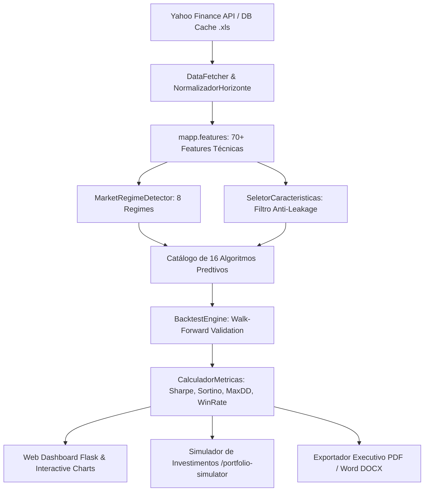

# M.A.P.P. — Market Analysis Pattern Prediction & AI Asset Predictor

Plataforma quantitativa de nível institucional para análise técnica automatizada, detecção de regimes de mercado, previsão probabilística de séries temporais com Inteligência Artificial e simulação comparativa de carteiras.

---

## 🌟 Principais Recursos da Plataforma

- **16 Algoritmos Preditivos**: De modelos quantitativos proprietários a Redes Neurais Profundas (MLP, LSTM, GRU, Transformers), Gradient Boosting (XGBoost, LightGBM), Meta-Heurísticas (Algoritmos Genéticos), Modelos Estocásticos (ARIMA, SARIMA, Prophet) e Simulação Multiagente (MiroFish).
- **M.A.P.P. Proprietary Engine**: Modelo de 4 pilares (Regime de Mercado, Estrutura e Acumulação, Padrões Técnicos, Momento & Divergências) com estimativa probabilística de direção, magnitude esperada e intervalo de confiança a 95%.
- **Classificador de 8 Regimes de Mercado**: Detecção dinâmica de `BULL_TREND`, `BEAR_TREND`, `SIDEWAYS`, `HIGH_VOLATILITY`, `LOW_VOLATILITY`, `BREAKOUT`, `CRASH` e `RECOVERY`.
- **Pipeline de Características Anti-Vazamento (Anti-Data-Leakage)**: Mais de 70 indicadores calculados estritamente com defasagens causais sem olhar para o futuro (`ValidadorAntiVazamento` e `SeletorCaracteristicas`).
- **Simulador de Investimentos Multi-Algoritmo (`/portfolio-simulator`)**: Wizard interativo em 5 etapas para comparação simultânea de múltiplos modelos, curvas de patrimônio (Equity Curve), Drawdown dinâmico, dispersão Risco x Retorno e ranqueamento multicritério ponderado.
- **Temporização Real e Transparente (`ProgressTracker`)**: Cálculo exato de tempo decorrido, tempo restante estimado e tempo total estimado no formato `HH:MM:SS` baseado no consumo real de ciclos (`time.perf_counter()`), sem animações estáticas ou contadores fictícios.
- **Normalização de Horizontes Flexíveis (`ForecastHorizon`)**: Suporte a dias, semanas, meses e anos com distinção rigorosa entre calendário de dias úteis da B3/bolsas tradicionais e mercado ininterrupto (24/7) de criptoativos.
- **Armazenamento e Cache Histórico em Excel (`db/`)**: Armazenamento automático e reutilização inteligente de bases históricas em arquivos `.xls` (ex: `db/bitcoin.xls`).
- **Relatórios Executivos com Nomenclatura Padronizada**: Emissão instantânea de relatórios completos em formatos PDF e Word (`.docx`) nomeados estritamente como `<ativo> <data_inicio> a <data_fim>.<ext>`.

---

## 🏗️ Arquitetura do Sistema



---

## 🤖 Catálogo dos 16 Algoritmos Integrados

| Algoritmo | Identificador | Categoria | Desempenho Típico | Documentação |
| :--- | :--- | :--- | :--- | :--- |
| **M.A.P.P.** | `mapp` | Quantitativo Multi-Pilar | ⭐⭐⭐⭐⭐ | [docs/algorithms/MAPP.md](docs/algorithms/MAPP.md) |
| **Ensemble** | `ensemble` | Ponderação Adaptativa por Regime | ⭐⭐⭐⭐⭐ | [docs/algorithms/ENSEMBLE.md](docs/algorithms/ENSEMBLE.md) |
| **Pattern Matching** | `pattern_matching` | Análogos Históricos / KNN | ⭐⭐⭐⭐ | [docs/algorithms/PATTERN_MATCHING.md](docs/algorithms/PATTERN_MATCHING.md) |
| **XGBoost** | `xgboost` | Gradient Tree Boosting | ⭐⭐⭐⭐⭐ | [docs/algorithms/README.md](docs/algorithms/README.md) |
| **LightGBM** | `lightgbm` | Fast Gradient Boosting | ⭐⭐⭐⭐⭐ | [docs/algorithms/README.md](docs/algorithms/README.md) |
| **Random Forest** | `random_forest` | Bagging Ensemble | ⭐⭐⭐⭐ | [docs/algorithms/README.md](docs/algorithms/README.md) |
| **LSTM** | `lstm` | Deep Learning Recorrente | ⭐⭐⭐⭐ | [docs/algorithms/README.md](docs/algorithms/README.md) |
| **GRU** | `gru` | Gated Recurrent Unit | ⭐⭐⭐⭐ | [docs/algorithms/README.md](docs/algorithms/README.md) |
| **Transformer** | `transformer` | Mecanismo de Auto-Atenção | ⭐⭐⭐⭐⭐ | [docs/algorithms/README.md](docs/algorithms/README.md) |
| **ARIMA / SARIMA** | `arima_sarima` | Séries Temporais Clássicas | ⭐⭐⭐ | [docs/algorithms/README.md](docs/algorithms/README.md) |
| **Prophet** | `prophet` | Decomposição Sazonal | ⭐⭐ | [docs/algorithms/README.md](docs/algorithms/README.md) |
| **Regressão Linear** | `regressao_linear` | Regularização L2 Ridge | ⭐⭐ | [docs/algorithms/README.md](docs/algorithms/README.md) |
| **Algoritmo Genético** | `algoritmo_genetico` | Computação Evolutiva | ⭐⭐⭐⭐ | [docs/algorithms/README.md](docs/algorithms/README.md) |
| **Rede Neural MLP** | `rede_neural` | Perceptron Multicamadas | ⭐⭐⭐⭐⭐ | [docs/algorithms/README.md](docs/algorithms/README.md) |
| **Lógica Fuzzy** | `logica_fuzzy` | Inferência Neuro-Fuzzy TSK | ⭐⭐⭐⭐ | [docs/algorithms/README.md](docs/algorithms/README.md) |
| **MiroFish** | `mirofish` | Simulação Multiagente | ⭐⭐⭐⭐⭐ | [docs/algorithms/README.md](docs/algorithms/README.md) |

---

## 📚 Documentação Técnica Completa

Explore a documentação modular detalhada nas pastas dedicadas:

- **[docs/algorithms/](docs/algorithms/)**: Formulação matemática, parâmetros e fundamentos teóricos de cada algoritmo.
  - [M.A.P.P. Engine](docs/algorithms/MAPP.md)
  - [Ensemble Multi-Regime](docs/algorithms/ENSEMBLE.md)
  - [Pattern Matching](docs/algorithms/PATTERN_MATCHING.md)
  - [Catálogo Completo](docs/algorithms/README.md)
- **[docs/features/](docs/features/)**: Especificação dos mais de 70 indicadores quantitativos e garantias contra vazamento de dados.
  - [Classificador de Regimes de Mercado](docs/features/MARKET_REGIME.md)
  - [Pipeline de Características](docs/features/README.md)
- **[docs/backtesting/](docs/backtesting/)**: Metodologia walk-forward, modelagem de custos (slippage, taxas) e métricas de performance.
  - [Motor de Backtesting](docs/backtesting/BACKTESTING.md)
- **[docs/simulation/](docs/simulation/)**: Manual de uso do Simulador de Investimentos, sistema de ranking multicritério e otimizador de hiperparâmetros.
  - [Guia do Simulador](docs/simulation/INVESTMENT_SIMULATOR.md)

---

## ⚡ Instalação e Execução

### 1. Pré-requisitos
- Python 3.10 ou superior.

### 2. Instalação das Dependências
```bash
pip install -r requirements.txt
```

### 3. Inicialização da Plataforma Web
```bash
# Inicia o servidor Flask na porta 5000 e abre automaticamente no navegador
python main.py

# Ou execute diretamente o backend web:
python web_app.py
```
- **Painel Preditivo Principal**: [http://127.0.0.1:5000](http://127.0.0.1:5000)
- **Simulador de Investimentos M.A.P.P.**: [http://127.0.0.1:5000/portfolio-simulator](http://127.0.0.1:5000/portfolio-simulator)

### 4. Execução da Suíte de Testes Automatizados
```bash
pytest tests/ -v
```

---

## ⚖️ Aviso Legal e Regulatório (Disclaimer)

> [!WARNING]
> Esta plataforma foi desenvolvida estritamente para fins educacionais, acadêmicos e de pesquisa quantitativa. Rentabilidade passada não representa garantia de rentabilidade futura. Modelos preditivos de séries temporais e Inteligência Artificial estão sujeitos a incertezas inerentes à dinâmica estocástica dos mercados. O sistema não constitui recomendação de compra ou venda de quaisquer ativos ou valores mobiliários nos termos da Instrução CVM nº 20/2021 ou padrões internacionais equivalentes. Os autores não se responsabilizam por decisões financeiras ou operacionais tomadas com base nas informações emitidas pela ferramenta.
